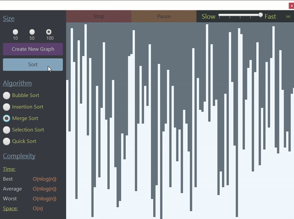
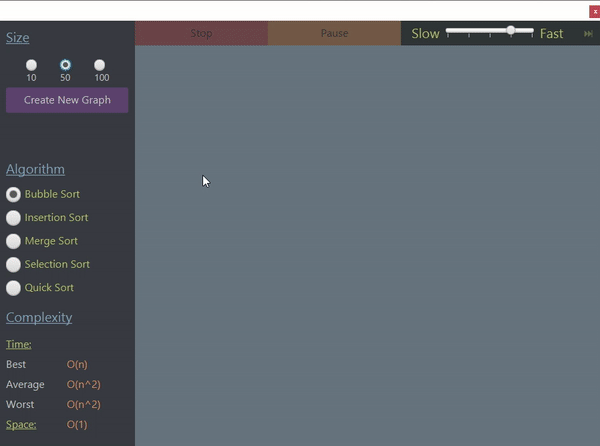

# SortVisualizer
Sort Visualizer is a program that demonstrates the process of
- Bubble sort
- Insertion sort
- Merge sort
- Selection sort
- Quick sort 

It sorts a graph of randomized bars step by step. A description of each algorithm's runtime and space complexities is also displayed whenever the algorithm is chosen. Here is an example of a merge sort process:

### Dynamically adjustable settings:
Here is an example of bubble sort with a slow speed selection to help see every step.

## Structure
This application is run on two Threads. The main thread is used for the visual display and button handling. The second thread is created whenever a new sorting process begins. By separating these two processes, the algorithm can change speed, stop, skip, and pause without interfering with the main thread's operation.
- [The Main Controller](SortVisualizer/src/application/MainController.java) fxml file holds all of the JavaFX element handlers. As the only connection between the algorithm and the user, it handles all user button selections as well as the intial graph creation and any user interruptions such as stopping, pausing, or skipping the algorithm.
- [Algorithm](SortVisualizer/src/application/SortingAlgs/Algorithm.java) is the abstract class that every sorting algorithm extends. It requires that every algorithm implements the sort method, but also holds many common methods such as painting bars, stopping and starting the sorting, changing algorithm speed, and swapping bars. 

##Build
- JavaFx-14
- jdk-14.0.1
- Eclipse IDE
- Windows 10
